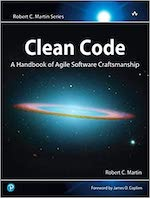
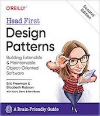

Quand on est passionné par un sujet, on a toujours envie d'apprendre.

Bien que les livres soient une source de connaissance impressionnante, certains peuvent devenir rapidement obsolètes (framework ou techno plus d'actualité, etc). D'autres peuvent être difficiles à lire ou comprendre.

Comment s'y retrouver au milieu de toute cette littérature ?

**Voici l'histoire de mon voyage littéraire.**

---

Avant de commencer ce voyage, présentons les **différents types de livres** :

- les livres techniques
- les livres conceptuels
- les livres comportementaux

### Les livres techniques

Comme leur nom l'indique, ces livres parlent de technique. Ils peuvent rapidement devenir obsolètes si le sujet en question a évolué depuis la publication.

Dans cette catégorie on va retrouver **les livres traitant d'un langage ou d'une technologie**.

Bien qu'ils soient utiles pour progresser sur un sujet en particulier, ils restent ancrés à leur date d'écriture.

### Les livres conceptuels

Contrairement aux livres techniques, ces livres vont traiter de **concepts pouvant être appliqués à différents contextes**.

On peut prendre comme exemple le livre [Design Patterns - GoF](https://www.amazon.fr/design-patterns-elements-reusable-object-oriented/dp/0201633612) qui peut s'appliquer à différents langages et qui reste toujours d'actualité.

### Les livres comportementaux

Enfin, les livres comportementaux ne traitent ni de technique ni de concept. Ils vont parler de **posture et d'état d'esprit**.

Cette catégorie regroupe les livres qui parlent d'agilité ou de software craft par exemple.

---

## Les livres que je recommande

Il existe des livres qui changent votre manière de voir les choses, d'autres qui confirment vos convictions.

La liste que je propose regroupe les livres qui ont défini ma méthodologie et mon attitude en tant que développeur.

### Clean Code - R. Martin

**Le livre par lequel tout a commencé.**

En lisant ce livre je me suis rendu compte qu'un univers s'ouvrait à moi.

Ma manière d'appréhender l'écriture du code a été complètement remise en question : **le fond et la forme sont aussi importants.**

> It is not enough for code to work. - R. Martin

> Truth can only be found in one place: the code. - R. Martin

Ce livre explique un tas de concepts aidant à produire du clean code.

### The Pragmatic Programmer - A. Hunt et D. Thomas

**Si je devais choisir LE livre à lire, ce serait celui-là !**

Comme je le disais plus haut, il y a des livres qui confirment vos convictions. L'univers ouvert grâce à la lecture de Clean Code s'est confirmé avec ce livre.

Bien qu'il ait 20 ans, ses concepts sont toujours d'actualité.

On y parle entre autre de :

- DRY
- Broken window
- Découplage
- Naming
- Refactoring
- Tests
- Outils

Les sujets couverts sont larges et très pertinants.

> You Can't Write Perfect Software. Did that hurt? It shouldn't. Accept it as an axiom of life. Embrace it. Celebrate it. Because perfect software doesn't exist. No one in the brief history of computing has ever written a piece of perfect software. It's unlikely that you'll be the first. And unless you accept this as a fact, you'll end up wasting time and energy chasing an impossible dream. - A. Hunt

> Names are deeply meaningful to your brain, and misleading names add chaos to your code. - A. Hunt

**LE livre indispensable.**

### Head First Design Patterns - E. Robson & E. Freeman

Si les deux précédents livres faisaient partis de la catégorie des livres comportementaux, celui-ci est conceptuel.

Quand j'ai voulu apprendre les design patterns existants, j'ai commencé par acheter le livre du Gang of Four.

Je l'ai très vite trouvé difficile à lire, presque imbuvable. Les exemples en c++ n'étaient pas nombreux et difficiles à comprendre.

Je me suis vite tourné vers ce livre qui est son opposé.

Les exemples sont nombreux et bien amenés. On comprend facilement les concepts, le livre étant facile à lire.
