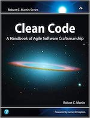

Quand on est passionné par un sujet, on a toujours envie d'apprendre.

Bien que les livres soient une source de connaissance énorme, certains peuvent devenir rapidement obsolètes (framework ou techno plus d'actualité, etc).

Comment s'y retrouver au milieu de cette bibliothèque ?

---

Tout d'abord il faut distinguer **plusieurs sortes de livres** :

- les livres techniques
- les livres conceptuels
- les livres comportementaux

### Les livres techniques

Comme leur nom l'indique, ces livres parlent de technique. Ils peuvent rapidement devenir obsolètes si le sujet en question a évolué depuis la publication.

Dans cette catégorie on va retrouver les livres traitant d'un langage ou d'une technologie par exemple.

### Les livres conceptuels

Contrairement aux livres techniques, ces livres vont traiter de concepts pouvant être appliqués à différents contextes.

On peut prendre comme exemple le livre [Design Patterns - GoF](https://www.amazon.fr/design-patterns-elements-reusable-object-oriented/dp/0201633612) qui peut s'appliquer à différents langages et qui reste toujours d'actualité.

### Les livres comportementaux

Enfin, les livres comportementaux ne traitent ni de technique ni de concept. Ils vont parler de posture et d'état d'esprit.

Cette catégorie regroupe les livres qui parlent d'agilité ou de software craft par exemple.

---

## Les livres que je recommande

Il existe des livres qui changent votre manière de voir les choses, d'autres qui confirment vos convictions.

La liste que je propose regroupe les livres qui ont défini ma méthodologie et mon attitude en tant que développeur.

### Clean Code - R. Martin

#### Le livre par lequel tout a commencé

En lisant ce livre j'ai eu l'impression qu'un univers s'ouvrait à moi.

### The Pragmatic Programmer - A. Hunt et D. Thomas

### The Software Craftman - S. Mancuso
